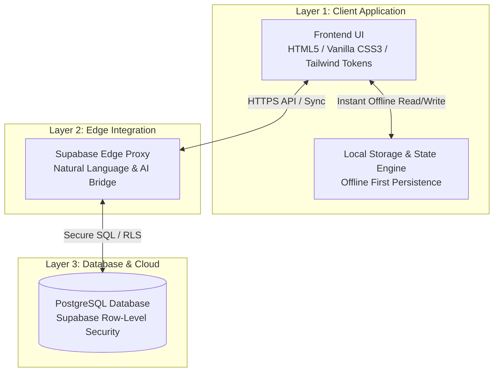

<div align="center">

# Peace of Mind 🌿

**A minimalist, mindful productivity ecosystem designed for calm focus, zero-friction task management, and sustainable consistency.**

[](https://github.com)
[](https://github.com)
[](https://github.com)
[](https://supabase.com)
[](https://github.com)

[Explore Features](#-why-peace-of-mind-is-different) • [Comparison](#-feature-comparison) • [User Journey](#-how-it-works-the-user-journey) • [Architecture](#-architecture-overview) • [Quick Start](#-quick-start)

---

</div>

## 📌 Overview

**Peace of Mind** is a modern daily goal tracker and long-term vision planner built to replace bloated, overwhelming productivity apps. Designed with an earth-toned glassmorphism interface and powered by smart natural language processing and Supabase infrastructure, it helps you manage your day without burnout.

> [!TIP]
> **Built for Everyone:** Whether you are a developer, designer, or non-technical user, Peace of Mind gets out of your way so you can focus on doing your best work.

---

## 🚫 The Problem

Most productivity applications promise organization, but deliver **cognitive fatigue**:

* 📑 **Tedious Form Filling:** Every simple task requires setting priorities, tags, categories, drop-down dates, and reminder alarms manually.
* 📉 **The Toxic Streak Trap:** Missing a single day breaks your "100% streak," causing guilt, demoralization, and eventual **app abandonment within 3 to 5 days**.
* 🔔 **Notification Fatigue:** Constant alerts, red badges, and push notifications induce anxiety rather than mindfulness.
* 🔒 **Data Lock-in & Complexity:** Over-engineered interfaces that demand hours of setup before you can write down your first idea.

---

## ✨ Why Peace of Mind Is Different

Peace of Mind fundamentally redesigns task tracking around **human behavior** and **mindfulness**.

### 🧠 1. Natural Language & Hands-Free Input
Say goodbye to manual drop-downs. Simply write or speak naturally:
> *"Finish project proposal by tomorrow 5pm under Work"*

Our intelligent engine parses the text and automatically extracts the title, due date, time, and category in milliseconds.

### 🛡️ 2. The Forgiving 50% Streak Rule
Life happens. Peace of Mind maintains your focus streak as long as you complete **50% or more** of your scheduled daily tasks.
* **Why it works:** It rewards consistency over toxic perfectionism, keeping momentum alive even on busy days.
* **Auto Carry-Over:** Unfinished tasks gracefully roll over to the next day without shame metrics.

### 🎨 3. Calm & Mindful Design System
* **Earth-Toned Aesthetics:** Soft sage greens, warm neutral tones, and subtle glassmorphic elements soothe eyes and mind.
* **Visual Progress Rings:** Beautiful weekly activity rings celebrate progress without overwhelming dashboards.

---

## ⚖️ Feature Comparison

| Feature / Metric | 🔴 Traditional Productivity Apps | 🌿 Peace of Mind |
| :--- | :--- | :--- |
| **Initial Setup** | Complex configuration, templates & plugins | ⚡ **Zero Setup** — Open & run immediately |
| **Data Entry** | Manual dropdowns, date pickers & tag pickers | 🗣️ **Natural Text & Voice Parsing** |
| **Streak Flexibility** | Rigid 100% (1 missed day resets streak to 0) | 💚 **Forgiving 50% Rule** (Sustainable progress) |
| **Task Rollover** | Manual rescheduling or lost backlog items | 🔄 **Automatic Smart Carry-Over** |
| **Privacy & Security** | Data mined for ads / cloud locked | 🔐 **100% Local-First & Private** |
| **Architecture** | Heavy proprietary monolithic servers | ⚡ **Lightweight UI + Supabase Edge & Postgres** |
| **Cognitive Load** | High (Red badges, overwhelming lists) | 🧘 **Low (Mindful glassmorphism & calm UI)** |

---

## 🔄 How It Works (The User Journey)

```
┌─────────────────┐      ┌──────────────────────┐      ┌──────────────────────┐      ┌──────────────────┐
│  1. Morning     │ ───► │  2. Natural Input    │ ───► │  3. Smart Category   │ ───► │  4. 50% Streak   │
│  Alignment      │      │  (Text / Voice)      │      │  & Auto-Rollover     │      │  Progress Ring   │
└─────────────────┘      └──────────────────────┘      └──────────────────────┘      └──────────────────┘
```

### 1️⃣ Morning Alignment
Start your day with a clean dashboard. Your weekly progress ring displays your momentum, while incomplete tasks from yesterday have automatically rolled over into today's focus list.

### 2️⃣ Expressive Input
Type or speak your thoughts into the single input field using natural phrasing or browser voice recognition. No multi-click forms required.

### 3️⃣ Smart Categorization & Goal Mapping
Tasks are instantly sorted into core life pillars:
* 💼 **Work & Projects**
* 🧘 **Health & Self-Growth**
* 🏠 **Personal & Errands**
* 🎯 **Long-Term Vision Milestones**

### 4️⃣ Mindful Execution & Progress Ring Closure
Complete tasks at your pace. Reaching 50% completion secures your streak for the day. Subtasks for complex goals can be broken down effortlessly with one click.

---

## 🏗️ Architecture Overview

Peace of Mind is architected across **3 decoupled, high-performance layers** that prioritize privacy, speed, and reliability.



### Layer Breakdown

1. 💻 **Frontend UI Layer (Client)**
   * **Tech:** Pure HTML5, Vanilla CSS3 (custom glassmorphism tokens), ES6 JavaScript.
   * **Behavior:** Operates directly in the browser with **instant state updates**. Local Storage guarantees full offline capability.

2. ⚡ **Supabase Edge Proxy Layer (API)**
   * **Tech:** Supabase Edge Functions / Proxy handlers.
   * **Behavior:** Lightweight serverless integration for parsing natural text queries and routing authentication tokens securely.

3. 🗄️ **PostgreSQL Database Layer (Storage)**
   * **Tech:** Supabase Managed PostgreSQL.
   * **Behavior:** Row-Level Security (RLS) ensures user data is private, encrypted, and synced seamlessly across devices.

---

## 🚀 Quick Start

You can run Peace of Mind locally in seconds with **zero build steps** or node package compilation.

### Prerequisites

* Any modern browser (*Chrome, Edge, Firefox, Safari*)
* `npx` (comes bundled with [Node.js](https://nodejs.org/)) or any local HTTP server

### Running Locally

1. **Clone the repository:**
   ```bash
   git clone https://github.com/your-username/peace-of-mind.git
   cd "peace of mind"
   ```

2. **Start the local server:**
   ```bash
   npx -y http-server . -p 8080 --cors -c-1
   ```

3. **Open in browser:**
   Navigate to [`http://localhost:8080`](http://localhost:8080) to launch the app!

> [!NOTE]
> For security and web API access (such as speech-to-text), the application must be served over an HTTP local server (`http://localhost:8080`) rather than directly opening the `file://` protocol.

---

## 🤝 Contributing

Contributions, issues, and feature requests are welcome! Feel free to check out the issues page or submit a pull request.

1. Fork the Project
2. Create your Feature Branch (`git checkout -b feature/AmazingFeature`)
3. Commit your Changes (`git commit -m 'Add some AmazingFeature'`)
4. Push to the Branch (`git push origin feature/AmazingFeature`)
5. Open a Pull Request

---

## 📄 License

Distributed under the **MIT License**. See `LICENSE` for more information.

<div align="center">

Made with 🌿 peace, clarity, and mindfulness.

</div>
